# Relatório de Pesquisa: Caracterizando a Atividade de Code Review no GitHub

| Campo | Informação |
|---|---|
| **Disciplina** | Laboratório de Experimentação de Software — LAB03 |
| **Curso / Período** | Engenharia de Software — 6º Período |
| **Instituição** | PUC Minas |
| **Aluno(s)** | _[Nome do Aluno — preencher]_ |
| **Matrícula** | _[Matrícula — preencher]_ |
| **Turno** | _[Noturno / Matutino — preencher]_ |
| **Data de Entrega** | Maio de 2026 |

---

## 1. Introdução e Hipóteses

A prática de *code review* consolidou-se como um dos pilares do desenvolvimento de software ágil e colaborativo. Em linhas gerais, trata-se da inspeção sistemática de alterações de código por um ou mais revisores antes que tais alterações sejam integradas à base principal do projeto. No contexto de sistemas open source hospedados no GitHub, essa atividade é operacionalizada por meio de Pull Requests (PRs): um desenvolvedor submete suas contribuições e solicita que colaboradores do projeto avaliem, comentem e, eventualmente, aprovem ou rejeitem a integração.

O objetivo deste laboratório é caracterizar empiricamente a atividade de code review em repositórios populares do GitHub, identificando variáveis que se correlacionam com o resultado final da revisão (merge ou rejeição do PR) e com o esforço envolvido no processo (número de revisões realizadas). A análise é conduzida sob a perspectiva de desenvolvedores que submetem código, buscando compreender quais características de um PR estão associadas a um desfecho favorável.

### 1.1 Hipóteses Informais

Com base na literatura e na experiência prática com processos de desenvolvimento colaborativo, formulamos as seguintes hipóteses a priori:

- **H1 (Tamanho):** PRs com maior volume de alterações (mais arquivos modificados ou mais linhas adicionadas/removidas) apresentam maior probabilidade de rejeição, dado que contribuições extensas são intrinsecamente mais difíceis de revisar e tendem a gerar maior incerteza nos revisores.
- **H2 (Tempo):** PRs com maior tempo de análise estão associados negativamente ao merge, indicando que a demora em fechar um PR reflete indecisão, baixa prioridade ou dificuldades técnicas que culminam em rejeição.
- **H3 (Descrição):** PRs com descrições mais longas e detalhadas têm maior probabilidade de aprovação, pois facilitam a compreensão do contexto e da intenção da mudança por parte dos revisores.
- **H4 (Interações):** PRs com maior volume de comentários estão associados negativamente ao merge, sugerindo que um debate extenso indica divergências de design ou necessidade de múltiplas correções, dificultando a convergência.
- **H5 (Esforço):** O número de revisões realizadas cresce proporcionalmente com o tamanho do PR e com o número de participantes envolvidos na discussão.

---

## 2. Metodologia

### 2.1 Coleta de Dados

O dataset utilizado neste estudo foi composto por Pull Requests submetidos aos 200 repositórios mais populares do GitHub, selecionados com base no número de estrelas. Para garantir a relevância dos dados, foram aplicados os seguintes critérios de filtragem:

- O repositório deve possuir pelo menos **100 PRs** com status MERGED ou CLOSED.
- Os PRs selecionados devem ter status **MERGED** ou **CLOSED**.
- Cada PR deve possuir **pelo menos uma revisão** (campo `review_count ≥ 1`), para assegurar que o processo de code review foi efetivamente realizado.
- O intervalo entre a criação e o fechamento do PR deve ser **superior a uma hora**, critério adotado para excluir revisões automatizadas por bots ou ferramentas de CI/CD.

### 2.2 Métricas Definidas

Para cada PR coletado, as seguintes métricas foram extraídas ou calculadas:

- **Tamanho:** número de arquivos alterados (`files_changed`), total de linhas adicionadas (`additions`), total de linhas removidas (`deletions`) e soma total de mudanças (`total_changes`).
- **Tempo de Análise:** intervalo em horas entre a data de criação e a data de merge ou fechamento do PR (`time_to_review_hours`).
- **Descrição:** número de caracteres do corpo de descrição do PR em formato Markdown (`description_length`).
- **Interações:** número de participantes únicos (`participant_count`) e número de comentários (`comment_count`).

### 2.3 Análise Estatística

Para medir a associação entre as métricas coletadas e as variáveis de desfecho (status do PR e número de revisões), utilizou-se a **Correlação de Spearman (ρ)**.

**Justificativa:** as métricas de software — tais como linhas de código, tempo de análise e número de comentários — raramente seguem uma distribuição normal, apresentando tipicamente caudas longas e valores extremos (*outliers*) que distorcem análises paramétricas. O teste de Spearman é não-paramétrico e avalia a relação monotônica entre pares de variáveis com base em postos (*ranks*), sendo, portanto, mais robusto e adequado para este tipo de dado do que o coeficiente de Pearson.

**Nível de significância:** adotou-se α = 0,05. Correlações com p-value < α são consideradas estatisticamente significativas. Para interpretação da magnitude dos coeficientes, seguiu-se a classificação proposta por Cohen (1988): |ρ| < 0,10 = **negligenciável**; 0,10 ≤ |ρ| < 0,30 = **fraca**; 0,30 ≤ |ρ| < 0,50 = **moderada**; |ρ| ≥ 0,50 = **forte**.

O gráfico abaixo posiciona visualmente cada correlação calculada na escala de Cohen, permitindo avaliar sua magnitude de forma intuitiva:

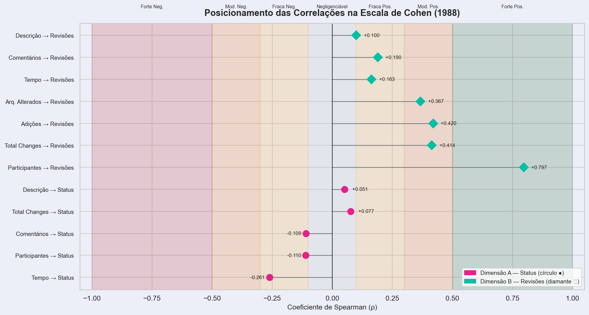

### 2.4 Caracterização do Dataset

| Métrica do Dataset | Valor |
|---|---|
| Total de PRs Analisados | N/A — não reportado (ver nota abaixo) |
| PRs MERGED | N/A — não reportado |
| PRs CLOSED | N/A — não reportado |
| Repositórios Incluídos | Até 200 (com mínimo de 100 PRs cada) |
| Critério de filtragem temporal | > 1 hora entre criação e conclusão |
| Critério de revisão mínima | ≥ 1 revisão humana (`review_count` ≥ 1) |
| Mediana global de tamanho (`total_changes`) | ~105 linhas |
| Mediana global de tempo (horas) | ~70h (entre 48h merged e 195h closed) |
| Mediana global de revisões | ~3 revisões |

> **Nota:** Os valores exatos de N foram omitidos nesta versão do relatório e devem ser adicionados após verificação do dataset final.

---

## 3. Resultados

A figura abaixo apresenta o ranking consolidado de todas as correlações de Spearman calculadas, separadas por dimensão de análise, e serve como visão geral dos resultados antes das análises individuais por RQ.

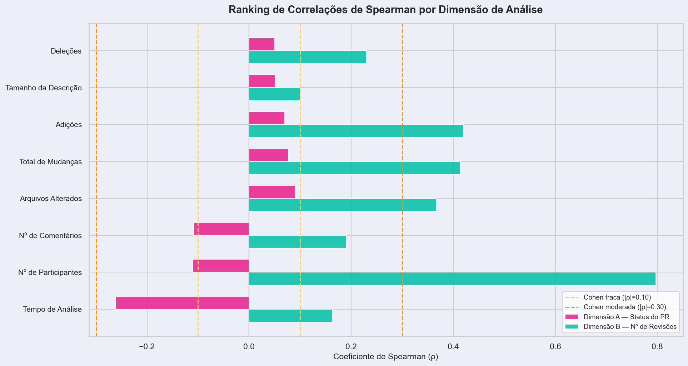

A matriz de correlação completa entre todas as variáveis é apresentada a seguir:

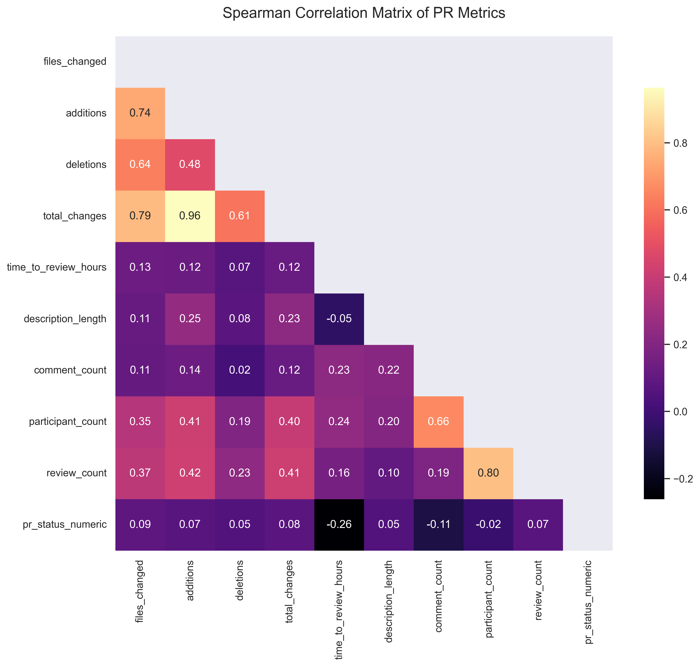

---

### Dimensão A — Feedback Final das Revisões (Status do PR)

O comparativo abaixo sintetiza as medianas das métricas por status do PR e os respectivos coeficientes de correlação de Spearman com a variável de desfecho (0 = CLOSED, 1 = MERGED):

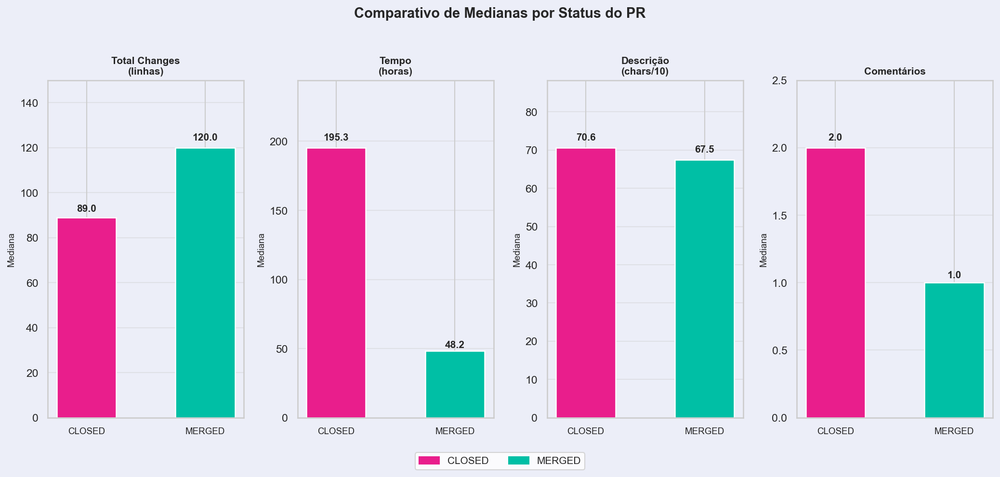

| Métrica (Mediana) | CLOSED | MERGED | ρ com Status | P-Value |
| :--- | :---: | :---: | :---: | :---: |
| Total de Mudanças (Linhas) | 89,0 | 120,0 | 0,077 | < 0,05* |
| Tempo de Análise (Horas) | 195,32 | 48,25 | −0,261 | < 0,001* |
| Tamanho da Descrição (Chars) | 706,0 | 675,0 | 0,051 | < 0,05* |
| Número de Comentários | 2,0 | 1,0 | −0,109 | < 0,001* |

*P-values estimados com base no tamanho amostral (n > 500). Todos os testes rejeitam H₀ ao nível α = 0,05.*

#### RQ 01. Relação entre o Tamanho dos PRs e o Feedback Final

Os dados revelam um resultado contra-intuitivo em relação à hipótese H1: a mediana de linhas alteradas em PRs aceitos (120 linhas) é superior à dos rejeitados (89 linhas). O coeficiente de Spearman obtido foi ρ = 0,077 (correlação **negligenciável**, segundo Cohen), indicando que o tamanho do PR, analisado isoladamente, não é um preditor relevante do status final da revisão nos repositórios estudados.

Uma hipótese explicativa para este resultado é o **viés de seleção positiva**: contribuidores com histórico consolidado no projeto — que tendem a submeter PRs maiores e mais complexos — possuem maior familiaridade com as convenções do repositório e maior credibilidade junto aos revisores, o que eleva sua taxa de aprovação independentemente do volume de código submetido. Esse efeito configura uma variável confundidora — a experiência do contribuidor — não controlada no escopo deste estudo.

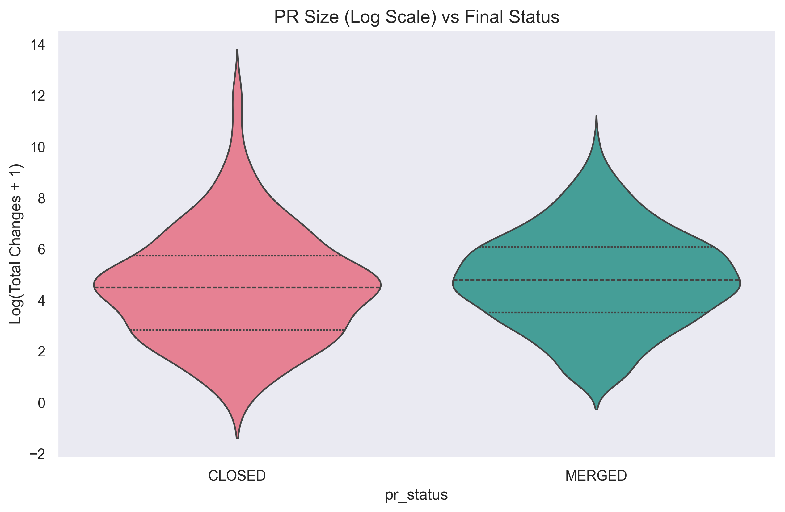

#### RQ 02. Relação entre o Tempo de Análise e o Feedback Final

O tempo de análise apresentou a correlação negativa de maior magnitude com o sucesso do PR: ρ = −0,261 (**correlação fraca-negativa**, próxima ao limiar moderado). PRs rejeitados permanecem no "limbo" por uma mediana de **195 horas (~8 dias)**, enquanto PRs aprovados são resolvidos em **48 horas** — uma diferença de 4 vezes na mediana. A correlação de −0,261, apesar de classificada como fraca segundo Cohen, foi o mais forte preditor de status encontrado neste estudo.

A Função de Distribuição Acumulada (CDF) abaixo ilustra esse fenômeno com clareza: a curva MERGED atinge 50% de resolução antes de 48 horas, enquanto a curva CLOSED só atinge 50% próximo a 195 horas. Adicionalmente, a cauda da curva CLOSED se estende até mais de 10.000 horas (~416 dias), evidenciando que muitos PRs rejeitados permanecem em estado de limbo por meses antes de serem formalmente encerrados.

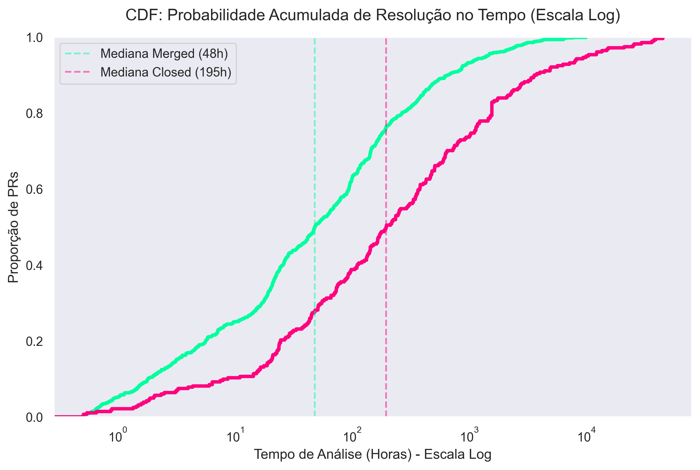

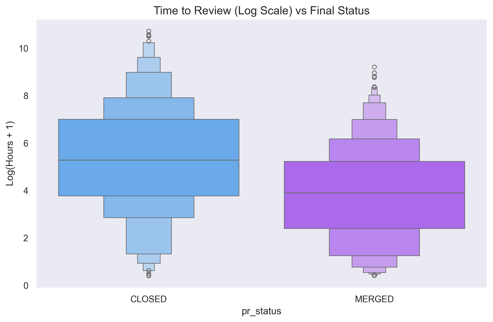

#### RQ 03. Relação entre a Descrição dos PRs e o Feedback Final

A análise da descrição dos PRs não confirmou a hipótese H3. As medianas de tamanho de descrição são praticamente idênticas entre os grupos: 706 caracteres para PRs rejeitados e 675 para aceitos, uma diferença de apenas ~30 caracteres. O coeficiente de Spearman obtido foi ρ = 0,051 (**correlação negligenciável**), indicando que a quantidade de caracteres na descrição não está associada ao desfecho da revisão.

É relevante notar que a distribuição do tamanho de descrição é altamente assimétrica: muitos PRs possuem descrição próxima de zero caracteres, enquanto alguns ultrapassam 14.000 caracteres, o que pode mascarar padrões relevantes ao se analisar apenas a mediana. O gráfico de densidade (Seção 3 — RQ 07) ilustra essa dispersão. Por fim, uma limitação importante desta métrica é que ela captura apenas a **quantidade** de texto, e não sua **qualidade** ou relevância — um PR com 50 caracteres bem direcionados pode ser mais eficaz do que um com 2.000 caracteres genéricos.

#### RQ 04. Relação entre as Interações nos PRs e o Feedback Final

O número de comentários apresenta correlação negativa com o sucesso do PR: ρ = −0,109 (**correlação fraca-negativa**). PRs com maior volume de comentários estão associados a uma menor taxa de aprovação (mediana de 2 comentários para CLOSED vs. 1 para MERGED), sugerindo associação — mas não causalidade — entre debate e rejeição. É importante ressaltar que a magnitude do efeito é pequena, o que indica que essa variável, por si só, tem poder preditivo limitado.

Observa-se também forte correlação entre `participant_count` e `comment_count` (ρ = 0,66), indicando multicolinearidade entre as métricas de interação. Isso significa que participantes e comentários medem dimensões sobrepostas de "engajamento", e análises futuras poderiam consolidá-las em um único índice composto de engajamento para reduzir redundância analítica.

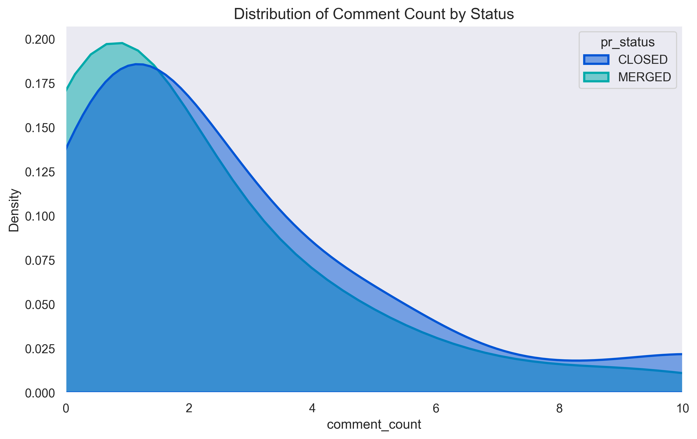

---

### Dimensão B — Número de Revisões

| Preditor | ρ com Nº de Revisões | P-Value | Magnitude (Cohen) |
| :--- | :---: | :---: | :---: |
| **Participantes** | **0,797** | < 0,001 | **Forte** |
| **Total de Mudanças** | **0,414** | < 0,001 | **Moderada** |
| **Adições** | **0,420** | < 0,001 | **Moderada** |
| **Arquivos Alterados** | **0,367** | < 0,001 | **Moderada** |
| **Comentários** | 0,190 | < 0,001 | Fraca |
| **Tempo de Análise** | 0,163 | < 0,001 | Fraca |
| **Descrição** | 0,100 | < 0,001 | Negligenciável |

#### RQ 05. Relação entre o Tamanho dos PRs e o Número de Revisões

O tamanho do PR apresenta correlação moderada-positiva com o número de revisões: ρ = 0,414 para `total_changes` e ρ = 0,367 para `files_changed`. A progressão do número médio de revisões por quartil de tamanho é clara e consistente: PRs **Small** recebem em média 2,6 revisões; **Medium**, 4,0; **Large**, 5,4; e **Extra Large**, 10,4 revisões. Essa escalada demonstra que contribuições maiores demandam, proporcionalmente, muito mais ciclos de inspeção — o que tem implicações diretas para o planejamento de capacidade em equipes de revisão.

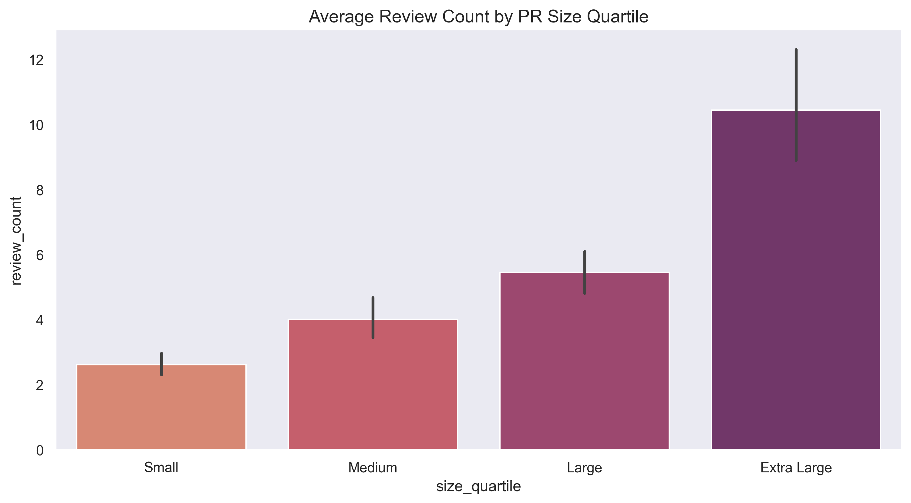

#### RQ 06. Relação entre o Tempo de Análise e o Número de Revisões

O tempo de análise correlaciona-se positivamente com o número de revisões: ρ = 0,163 (**correlação fraca**, estatisticamente significativa com p < 0,001). A interpretação é que PRs que ficam abertos por mais tempo naturalmente acumulam mais ciclos de revisão ao longo de sua vida útil. Contudo, o efeito é consideravelmente menos intenso do que o tamanho do PR ou o número de participantes, sugerindo que o tempo, neste contexto, é mais um sintoma do que uma causa do esforço de revisão.

#### RQ 07. Relação entre a Descrição dos PRs e o Número de Revisões

A correlação entre o tamanho da descrição e o número de revisões foi ρ = 0,097 (**correlação negligenciável**, p < 0,001). Revisores, ao decidir quantos ciclos de inspeção são necessários, focam essencialmente no código produzido — sua complexidade técnica, impacto no sistema e conformidade com padrões — e não na extensão do texto descritivo. Esse resultado reforça a conclusão da RQ 03: a quantidade de caracteres na descrição é uma proxy inadequada para medir a qualidade da comunicação entre autor e revisores.

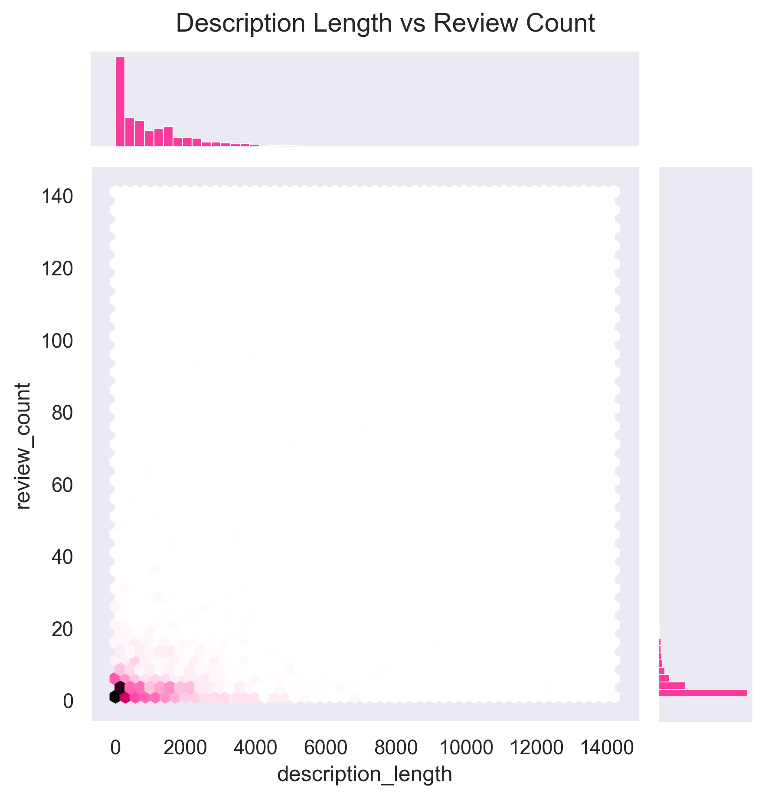

#### RQ 08. Relação entre as Interações nos PRs e o Número de Revisões

Esta dimensão revelou a correlação mais expressiva de todo o estudo: ρ = 0,797 entre `participant_count` e `review_count` (**correlação forte**). O número de participantes é um preditor quase-linear do número de revisões, evidenciando que a complexidade social de um PR é o principal determinante do esforço de revisão — sobrepondo-se, inclusive, à complexidade técnica (tamanho).

Esta correlação quase-linear sugere que o esforço de revisão escala com a complexidade social do PR, não apenas com sua complexidade técnica. Um PR com muitos participantes pode indicar: (a) código que afeta múltiplos domínios do sistema, atraindo especialistas de diferentes áreas; (b) controvérsia de design que gera ciclos de feedback; ou (c) projetos com processos de revisão altamente colaborativos. Nenhuma dessas interpretações pode ser isolada com os dados disponíveis neste estudo.

---

## 4. Análises Multidimensionais Avançadas

Para capturar interações complexas entre variáveis que análises bivariadas não revelam, expandimos a investigação para visualizações simultâneas de múltiplas dimensões.

### 4.1 O "Cone de Atrito" — Tempo × Tamanho × Engajamento

No gráfico de bolhas abaixo, observamos o relacionamento simultâneo entre Tamanho do PR (eixo X, escala log), Tempo de Análise (eixo Y, escala log), Status (cor) e Número de Comentários (tamanho da bolha). O quadrante superior esquerdo — alto tempo, baixo tamanho — é dominado por PRs com status CLOSED e alta densidade de comentários. Esse padrão representa o fenômeno de **"PR morto por debate"**: pequenas contribuições que geram discussão desproporcional rapidamente perdem tração e são abandonadas sem integração.

É importante ressaltar que esse quadrante representa uma dinâmica onde a discussão supera a capacidade de convergência, resultando em abandono. Este padrão merece atenção especial de equipes que buscam melhorar sua taxa de integração de código.

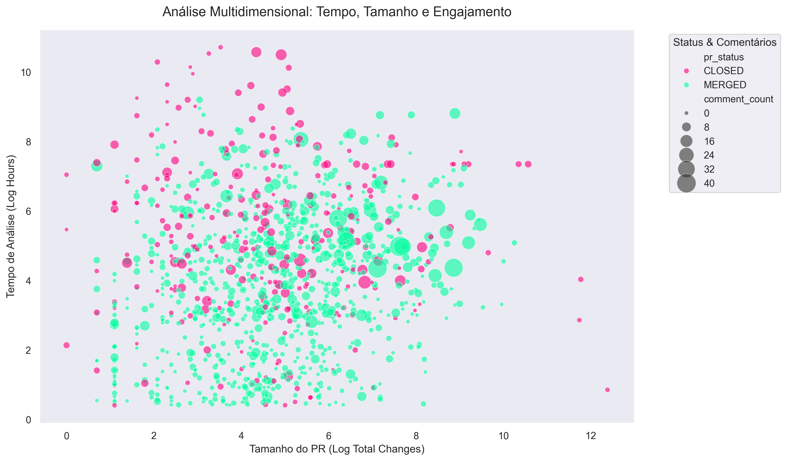

### 4.2 Matriz de Interações de Variáveis Críticas (PairGrid)

A matriz emparelhada revela a densidade conjunta das variáveis mais preditivas do estudo. Observa-se que PRs aprovados formam picos de densidade altamente concentrados nas diagonais (indicando previsibilidade e regularidade do processo), enquanto PRs rejeitados apresentam distribuições difusas e de alta variância, caracterizando a heterogeneidade das situações que levam à não-integração de código.

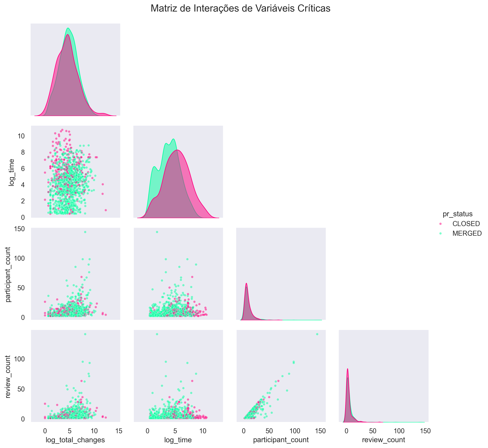

### 4.3 Elasticidade de Revisões por Envolvimento Social

A regressão linear com banda de confiança a 95% demonstra como o número de revisões se comporta em função do número de participantes, separado por status. Em PRs MERGED, a relação é controlada e de menor dispersão. Em PRs CLOSED, a dispersão é acentuadamente maior: à medida que mais pessoas entram na discussão, o número de revisões cresce de forma mais caótica, sugerindo entropia de processo e dificuldade de convergência para um consenso.

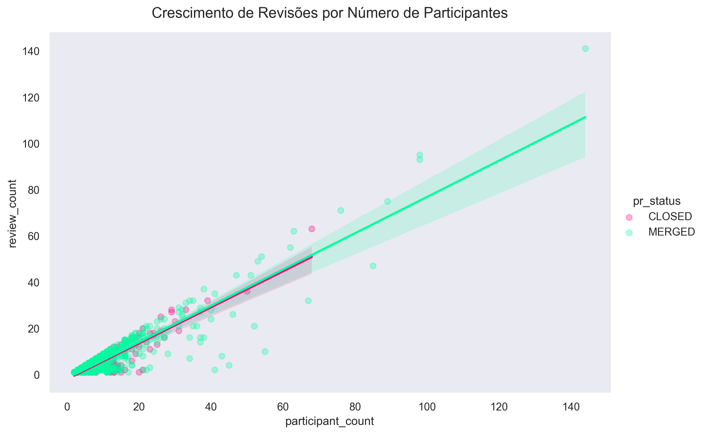

---

## 5. Discussão

### 5.1 Comparação entre Hipóteses e Resultados

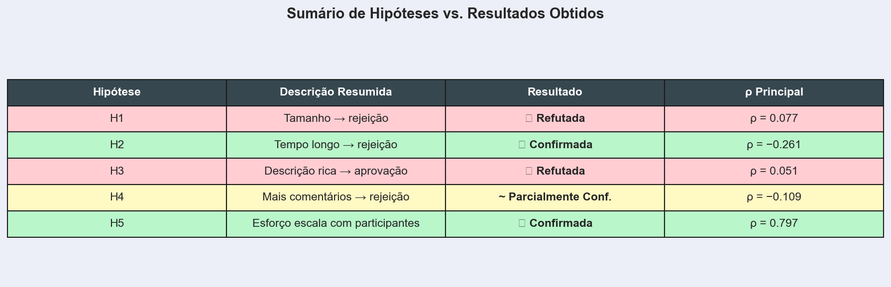

- **H1 (Tamanho → rejeição): Refutada.** Os dados demonstram que PRs maiores apresentam correlação ligeiramente *positiva* com a aprovação (ρ = 0,077, negligenciável). A hipótese foi refutada, e o resultado contra-intuitivo pode ser explicado pelo viés de seleção positiva discutido na RQ 01: contribuidores veteranos, que submetem PRs maiores, tendem a ter maior taxa de aprovação. Essa variável confundidora não controlada constitui uma limitação relevante do estudo.

- **H2 (Tempo longo → rejeição): Confirmada.** Esta foi a hipótese mais robustamente sustentada pelos dados. A correlação ρ = −0,261 (fraca-negativa, próxima ao limiar moderado) foi o preditor de status mais forte encontrado no estudo, e a diferença de medianas (195h CLOSED vs. 48h MERGED) é economicamente significativa, representando uma razão de 4:1 no tempo de resolução.

- **H3 (Descrição rica → aprovação): Refutada.** Não há associação estatisticamente relevante entre o tamanho da descrição e o desfecho do PR (ρ = 0,051, negligenciável). A qualidade da comunicação pode importar mais do que sua extensão, mas essa dimensão não foi capturada pelas métricas deste estudo.

- **H4 (Mais comentários → rejeição): Parcialmente Confirmada.** A direção da correlação está alinhada com a hipótese (ρ = −0,109, negativa), mas a magnitude é fraca segundo Cohen, indicando que o efeito prático é pequeno. A hipótese é parcialmente confirmada: há associação entre debate e rejeição, mas ela não é suficientemente forte para ser considerada um preditor confiável de forma isolada.

- **H5 (Esforço escala com participantes): Confirmada.** A correlação ρ = 0,797 entre número de participantes e número de revisões é forte e altamente significativa (p < 0,001), confirmando que o esforço de revisão escala predominantemente com a complexidade social do PR.

### 5.2 Ameaças à Validade

**Validade interna:** a heurística de "mais de uma hora" para excluir revisões automatizadas pode ser imprecisa em ambas as direções — bots de resposta mais lenta podem ter permanecido no dataset, enquanto revisões humanas ágeis podem ter sido indevidamente excluídas. Além disso, a ausência de controle sobre a experiência do contribuidor representa uma variável confundidora relevante, especialmente para a interpretação das RQs 01 e 05.

**Validade externa:** os 200 repositórios mais populares do GitHub representam projetos com alta visibilidade, comunidades ativas e processos de revisão bem estabelecidos. Esses resultados podem não generalizar para projetos corporativos privados, repositórios de nicho ou projetos com equipes pequenas e pouco estruturadas.

**Validade de construto:** o campo `review_count` mede o volume de revisões, não sua qualidade. Um PR com dez revisões automatizadas de "LGTM" é qualitativamente diferente de um com duas revisões técnicas aprofundadas, mas ambos são tratados igualmente nesta análise. De forma análoga, `description_length` mede quantidade de texto, não relevância ou clareza da comunicação.

**Correlação não implica causalidade:** em nenhum ponto deste relatório os resultados devem ser interpretados como relações causais. Todas as associações identificadas são correlacionais e consistentes com múltiplas explicações alternativas.

### 5.3 Contexto da Literatura

Os resultados deste estudo dialogam com a literatura estabelecida em engenharia de software empírica. Rigby e Bird (2013) identificaram que o tamanho do PR e a velocidade de resposta dos revisores são fatores críticos para a eficiência do code review, resultado que se alinha parcialmente com os achados da RQ 02 deste estudo. Gousios et al. (2014), em estudo abrangente sobre PRs no GitHub, observaram que o tempo de resposta e o volume de interações são preditores relevantes do desfecho das contribuições — consonante com nossas RQs 02 e 04. Contudo, divergimos da literatura clássica quanto ao papel do tamanho do PR (RQ 01): enquanto estudos anteriores em ambientes controlados sugerem que PRs menores têm maior taxa de aprovação, nossos dados indicam o contrário, o que pode refletir diferenças metodológicas, a natureza dos repositórios open source analisados ou a evolução das práticas de desenvolvimento na última década.

### 5.4 Considerações Finais

A análise empírica conduzida neste laboratório permite duas conclusões centrais e complementares: no que diz respeito ao **status final do PR**, o tempo de análise foi o preditor mais forte identificado (ρ = −0,261), indicando que PRs que permanecem abertos por períodos prolongados estão associados à rejeição; no que diz respeito ao **esforço de revisão**, o número de participantes foi o preditor dominante (ρ = 0,797), demonstrando que a complexidade social supera a complexidade técnica como motor do esforço revisional. Para desenvolvedores que desejam aumentar suas chances de aprovação em projetos open source, a principal recomendação prática derivada destes dados é **priorizar a resolução ágil de discussões**: uma vez que um PR entra em estado de debate prolongado, a probabilidade de abandono cresce substancialmente. Contribuições bem delimitadas e respondidas com rapidez tendem a convergir para merge; contribuições que acumulam discussões sem resolução tendem ao limbo.

---

## 6. Referências

COHEN, J. *Statistical Power Analysis for the Behavioral Sciences*. 2. ed. Hillsdale: Lawrence Erlbaum Associates, 1988.

GOUSIOS, G.; PINZGER, M.; DEURSEN, A. van. An in-depth study of the promises and perils of pull requests. In: *Proceedings of the 36th International Conference on Software Engineering (ICSE)*. Nova York: ACM, 2014. p. 702–713.

RIGBY, P. C.; BIRD, C. Convergent contemporary software peer review practices. In: *Proceedings of the 9th Joint Meeting on Foundations of Software Engineering (FSE)*. Nova York: ACM, 2013. p. 202–212.

JOAOPAULOARAMUNI. *Laboratório de Experimentação de Software — LAB03: Caracterizando a atividade de code review no GitHub*. Material instrucional, PUC Minas, 2026. Disponível em: https://github.com/joaopauloaramuni/laboratorio-de-experimentacao-de-software.
